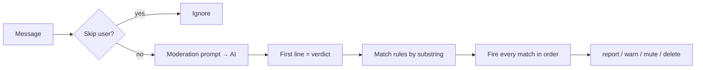

# Gennady Cookbook

*Languages: **English** | [Русский](cookbook_ru.md)*

Practical recipes for shaping the bot's behavior through **AI prompts + config options**.
Every recipe below is a combination of a prompt technique and the config keys that make it
work. For an exhaustive list of every key see [config.md](config.md) and the auto-generated
[CONFIG_REFERENCE_en.md](CONFIG_REFERENCE_en.md).

> All prompt examples can be edited live in the Web UI (no restart needed) or in `config.yaml`.
> Use the Web UI **Diagnostics → prompt preview** to see exactly what the model receives.

## Table of contents

- [How moderation actually works](#how-moderation-actually-works)
- [Prompt placeholders reference](#prompt-placeholders-reference)
- [Recipe 1: Invent your own verdict vocabulary](#recipe-1-invent-your-own-verdict-vocabulary)
- [Recipe 2: Stack actions on one verdict (delete + mute)](#recipe-2-stack-actions-on-one-verdict-delete--mute)
- [Recipe 3: A "let the admins decide" escape hatch](#recipe-3-a-let-the-admins-decide-escape-hatch)
- [Recipe 4: Central rulebook with `{{chat_rules}}`](#recipe-4-central-rulebook-with-chat_rules)
- [Recipe 5: Reputation-aware strictness](#recipe-5-reputation-aware-strictness)
- [Recipe 6: New-member profile screening](#recipe-6-new-member-profile-screening)
- [Recipe 7: Don't punish people for what they quote](#recipe-7-dont-punish-people-for-what-they-quote)
- [Recipe 8: Image moderation (Vision / OCR / Content Safety)](#recipe-8-image-moderation-vision--ocr--content-safety)
- [Recipe 9: React to Azure Content Safety with `content-security`](#recipe-9-react-to-azure-content-safety-with-content-security)
- [Recipe 10: Personalized AI warnings with tone control](#recipe-10-personalized-ai-warnings-with-tone-control)
- [Recipe 11: Mute notices with re-verification instructions](#recipe-11-mute-notices-with-re-verification-instructions)
- [Recipe 12: Give the bot a personality (creative replies)](#recipe-12-give-the-bot-a-personality-creative-replies)
- [Recipe 13: Cost control - light vs full model & failover](#recipe-13-cost-control--light-vs-full-model--failover)
- [Recipe 14: Whitelists, admins and excluded users](#recipe-14-whitelists-admins-and-excluded-users)
- [Recipe 15: Context-aware political / topical nuance](#recipe-15-context-aware-political--topical-nuance)
- [Recipe 16: On-demand easter eggs and command phrases](#recipe-16-on-demand-easter-eggs-and-command-phrases)
- [Recipe 17: Teach summaries your jargon and editorial guardrails](#recipe-17-teach-summaries-your-jargon-and-editorial-guardrails)
- [Recipe 18: Graceful failure sentinels and signature sign-offs](#recipe-18-graceful-failure-sentinels-and-signature-sign-offs)
- [Recipe 19: Let emoji reactions inform summaries and replies](#recipe-19-let-emoji-reactions-inform-summaries-and-replies)
- [Troubleshooting](#troubleshooting)

---

## How moderation actually works

Understanding the pipeline makes every recipe obvious:

1. A message arrives. Unless the user is skipped (admin/whitelist/excluded), the **moderation
   prompt** is sent to the AI (the **light model** by default).
2. The bot reads the AI response and takes **only the first line** as the *verdict line*.
   Everything after the first line is treated as an optional human-readable *reason* (logged
   and shown to admins, never parsed for actions).
3. Each rule in `ai.content_moderation.rules` has a `trigger`. If the trigger appears as a
   **case-insensitive substring of the verdict line**, that rule fires.
4. **Every matching rule fires, in declaration order.** This is why you can stack actions.
5. Actions are one of: `report`, `warn`, `mute`, `delete`.



Two consequences you should design around:

- **Keep verdicts short and on the first line.** Moderation responses are capped at a small
  token budget, so a one-word verdict + a one-line reason is the ideal shape.
- **Triggers are substrings.** `trigger: "spam"` matches `spam`, `Spam`, `spam, profanity`.
  Pick verdict words that don't accidentally contain one another.

**On-demand complaints.** A member can flag a message by **replying to it and mentioning the
bot**. The bot re-runs moderation across *every* configured model (the web UI **"Moderate
again"** button does the same) and acts if any model flags it. If every model clears the
message, `ai.content_moderation.complaint_manual_moderation` decides what happens: `true`
(default) posts the admin decision card, `false` drops the complaint silently.

---

## Prompt placeholders reference

Placeholders are replaced before the prompt is sent. Each prompt only supports its own set.

| Prompt (`ai.…`) | Placeholders |
| --- | --- |
| `content_moderation.prompt` | `{{message}}`, `{{chat_rules}}`, `{{user_profile}}`, `{{user_reputation}}`, `{{reply_to}}`, `{{new_user_rules}}` |
| `content_moderation.warning_prompt` | `{{username}}`, `{{user_message}}`, `{{chat_rules}}`, `{{mute_info}}`, `{{reputation}}` |
| `creative_replies.prompt` | `{{message}}`, `{{context}}`, `{{quote}}` |
| `morning_greeting.prompt` | `{{weekday}}`, `{{date}}`, `{{weather}}`, `{{weather_ru}}`, `{{holidays}}`, `{{events}}` |
| `daily_summary.prompt` | `{{messages}}` |
| `message_summaries.prompt` | `{{message}}` |
| `link_summaries.prompt` | `{{title}}`, `{{url}}`, `{{content}}`, `{{truncated_suffix}}` |
| `user_profiles.prompt` | `{{username}}`, `{{messages}}` |
| `user_profiles.update_prompt` | `{{username}}`, `{{messages}}`, `{{existing_profile}}` |
| `translation_prompt` / `rss.*` | `{{text}}` |

**`{{user_profile}}` vs `{{user_reputation}}`:**

- `{{user_profile}}` expands to a **rich block** - AI profile text + reputation, 7-day
  warning/mute stats, an activity chart, an admin marker, and username-reuse warnings. Most
  context, more tokens.
- `{{user_reputation}}` expands to a **compact block** - just the reputation score and a
  suspicious-profile note (with reasons) if present. Token-cheap; use it when you only need
  the score.

Both are empty unless `ai.user_profiles.enabled: true` (or
`content_moderation.new_user_profile_check_enabled: true`).

**`{{new_user_rules}}`:** expands to your `ai.content_moderation.new_user_rules` text **only**
while a user is "new" - within `ai.content_moderation.new_user_window_hours` (default 24) of
their first observed message - and is empty for everyone else. Use it to enforce stricter
first-poster rules (no links, no promo) without touching the rules for regulars.

**`{{weather}}` vs `{{weather_ru}}`:** the morning greeting exposes the forecast in two
pre-formatted variants - `{{weather}}` is English-formatted, `{{weather_ru}}` is
Russian-formatted. Use whichever matches your prompt's language; you don't have to translate
the forecast yourself.

---

## Recipe 1: Invent your own verdict vocabulary

You are not limited to `spam`/`profanity`/`nsfw`. Tell the model to answer with **whatever
words you want**, then map those words to actions. Keep them on the first line.

```yaml
ai:
  content_moderation:
    prompt:
      system: |
        You are a chat moderation classifier. Decide whether the message breaks the rules.
        Chat rules: {{chat_rules}}

        Reply with ONLY ONE of these words on the FIRST line: "spam", "abuse", "maybe", "ok".
        On the SECOND line you may add a one-sentence reason if it was a violation.
      user: |
        {{user_profile}}

        Message to analyze:
        «{{message}}»

        Additional context (DO NOT moderate this!):
        {{reply_to}}

        Answer with one word on the first line.
    rules:
      - { trigger: "spam",  action: delete, description: "Spam",    notify_admin: false }
      - { trigger: "abuse", action: report, description: "Abuse",   notify_admin: true  }
      - { trigger: "maybe", action: report, description: "Borderline", notify_admin: true }
```

Why this works: the verdict word only needs to be a **substring of the first line**. Multi-word
or multilingual verdicts are fine (the reference config uses Russian words like `спам`, `мат`,
`хз`, `нет`).

---

## Recipe 2: Stack actions on one verdict (delete + mute)

List the **same trigger twice** with different actions. Both fire, in order. This deletes the
spam *and* mutes the spammer in one shot.

```yaml
rules:
  - { trigger: "spam", action: delete, description: "Spam", notify_admin: false }
  - { trigger: "spam", action: mute,   description: "Spam", notify_admin: false }
```

The mute duration comes from `default_mute_minutes`:

```yaml
ai:
  content_moderation:
    default_mute_minutes: 0   # 0 = permanent mute; e.g. 60 = one hour
```

> Order matters: put `delete` before `mute` if you want the message gone first. Every matching
> rule runs regardless.

---

## Recipe 3: A "let the admins decide" escape hatch

Add an "uncertain" verdict that only **reports** to the admin chat instead of taking an
automatic action. Great for borderline cases where false positives are costly.

```yaml
ai:
  content_moderation:
    prompt:
      system: |
        … reply "spam", "abuse", "unsure", or "ok" on the first line.
        Use "unsure" when you suspect a violation but aren't confident - a human will decide.
    rules:
      - { trigger: "unsure", action: report, description: "Needs a human", notify_admin: true }
```

`report` posts the message to the admin chat with inline buttons (mute / warn / delete) so a
moderator can act with one tap.

---

## Recipe 4: Central rulebook with `{{chat_rules}}`

Write your community rules **once** in `ai.chat_rules` and inject them into any prompt with
`{{chat_rules}}`. Update the rules in one place and every prompt follows.

```yaml
ai:
  chat_rules: |-
    Not allowed in this chat:
      - Profanity directed at another member (a standalone swear as an exclamation is fine).
      - Personal insults, harassment, threats.
      - Advertising, promo codes, referral links, mass DMs.
      - Emoji-only messages or "come relax" offers from brand-new users.
    Allowed:
      - The word "хуйло" applied to the presidents of certain countries is not a violation.
  content_moderation:
    prompt:
      system: |
        Decide if the message breaks the rules. Chat rules: {{chat_rules}}
        …
    warning_prompt:
      system: |
        Write a warning. Chat rules: {{chat_rules}}
        …
```

This keeps the moderation prompt and the warning prompt perfectly consistent.

---

## Recipe 5: Reputation-aware strictness

Turn on AI user profiles. A daily job builds a short profile per active user ending in
`Reputation: good|neutral|bad`. That reputation is then injected into moderation so the bot can
be lenient with trusted regulars and strict with known troublemakers.

```yaml
ai:
  user_profiles:
    enabled: true
    time: "04:50"          # daily rebuild time (off-peak)
    skip_forever_muted_users: false
  content_moderation:
    prompt:
      system: |
        … If a user profile is provided, use it:
        - If a user normally talks in a blunt/edgy style and their reputation is fine,
          don't treat their usual style as a violation.
        - If behavior sharply shifts toward aggression or trolling, that IS a violation.
        - For users with bad reputation, be stricter.
      user: |
        {{user_profile}}

        Message to analyze:
        «{{message}}»
```

The feedback loop: messages → daily profile + reputation → injected into moderation → smarter
decisions tomorrow. Use `{{user_reputation}}` instead of `{{user_profile}}` if you want the
same signal at a fraction of the token cost.

---

## Recipe 6: New-member profile screening

Spam bots advertising "18+" services are tricky: their **message** is often just a string of
emojis (💋🔥💦) with no moderatable text, so a text-only check waves them through. Their
**profile**, however - photo, bio, and linked personal channel - usually gives them away.
The `new_user_profile_check_enabled` check screens the member's **whole public profile in one
shot**, on their first message in a moderation chat (runs **once** per user per chat - no
rate-limit concerns): name, bio and profile photo, plus their **linked personal channel**
(name, description, photo) when present.

Photos are screened with **Azure Content Safety first**; Azure Vision and OCR.space are used to
*describe* a photo only when Content Safety is unavailable or fails. *All* the gathered text is
then judged by a dedicated AI prompt. **The check does not require Content Safety** - if it's
off, Vision or OCR.space describe the photos instead.

```yaml
ai:
  content_moderation:
    new_user_profile_check_enabled: true
    # Photo screening prefers Content Safety; Vision/OCR.space are the fallback
    # describers. Configure at least one so photos can be analyzed:
    content_safety_enabled: true    # primary photo signal (recommended)
    vision_enabled: true            # fallback describer (or ocrspace_enabled)
    new_user_profile_prompt:
      system: |
        You are a moderation assistant screening a new chat member's public profile.
        You are given their name, bio and a description of their profile photo, and,
        if present, the name, description and photo of their linked personal channel.
        Identify signals of spam, scams, paid promotion, adult/NSFW content, hate
        speech, or other policy-violating intent. Reply with a single short line. If
        nothing is concerning, reply with exactly CLEAN. Otherwise reply with a brief
        description of the concern.
      user: |
        Analyze the following profile:

        {{profile_text}}
```

The prompt receives everything the bot collected - name, username, bio, profile-photo
description, channel name/description and channel-photo description - via `{{profile_text}}`.
Reply **`CLEAN`** to record nothing; any other reply becomes a finding on the user's profile.

### The unified `suspicious-profile` marker

Whenever the check fires (a flagged photo, or the AI judging the profile suspicious), the bot
stamps a single stable marker on the user's profile:

```
[moderation:suspicious-profile]
```

This is your one reliable hook. Reference it in the moderation prompt to treat such users
harshly:

```yaml
    prompt:
      user: |
        If the message is only emoji or a "come relax" offer AND the user is posting their
        first message today, OR their profile carries the mark
        `moderation:suspicious-profile`, answer "spam".

        {{user_profile}}

        Message: «{{message}}»
```

How it surfaces to the moderation model:

- **`{{user_profile}}`** (full block) - a prominent *SUSPICIOUS PROFILE* line **plus** the
  recorded profile text (markers and the concrete reason, e.g. `Spam: crypto promo channel`).
- **`{{user_reputation}}`** (compact block) - the suspicious header **plus** bulleted
  reason line(s), so even token-cheap prompts see *why* the profile was flagged.

---

## Recipe 7: Don't punish people for what they quote

When a user replies to an offending message, `{{reply_to}}` gives the model the quoted text as
context. But you don't want to mute the *replier* for the quote. Two safeguards:

1. **Tell the model explicitly** that the reply context is not under moderation:

   ```yaml
   user: |
     Message to analyze:
     «{{message}}»

     Additional context, if any (DO NOT moderate this!):
     {{reply_to}}
   ```

   The bot uses the **specific span** the user highlighted when replying (Telegram quotes),
   not just the full text of the replied-to message - so the model sees exactly what was
   quoted. This precise quote also feeds user profiles, daily summaries and creative replies.

2. **Automatic retry (built in).** If Azure's content filter fires *and* `{{reply_to}}` context
   was included, the bot automatically retries the request **without** the reply context - so
   the quoted material can't get the replier penalized. You get this for free; the prompt note
   just reinforces it.

---

## Recipe 8: Image moderation (Vision / OCR / Content Safety)

Catch violations hidden in screenshots and memes by extracting their text/content and running
it through the **same** moderation rules. Two sources, used as a fallback chain
**Azure Vision → OCR.space**:

```yaml
ai:
  content_moderation:
    # Best accuracy - Azure Vision (captioning + OCR)
    vision_enabled: true
    vision_endpoint: "https://YOUR.cognitiveservices.azure.com/"
    vision_api_key: "KEY"

    # Optional cloud OCR with a free tier, no self-hosting
    ocrspace_enabled: false
    ocrspace_api_key: ""
    ocrspace_engine: 2        # 2 = best all-round, 3 = highest accuracy
```

Extracted text flows into your normal moderation prompt, so all your verdict/rule recipes apply
to images too. For reliable moderation, prefer **Azure Vision**.

---

## Recipe 9: React to Azure Content Safety with `content-security`

`content-security` is a **reserved trigger**. When Azure Content Safety blocks content, the bot
dispatches it through your rules using this trigger - so you decide what happens.

```yaml
rules:
  - { trigger: "content-security", action: report, description: "Safety filter fired", notify_admin: true }
  # Or be aggressive:
  # - { trigger: "content-security", action: delete, notify_admin: false }
  # - { trigger: "content-security", action: mute,   notify_admin: false }
```

If Content Safety fires but **no** `content-security` rule is configured, the event is skipped
with a log line - so always add at least a `report` rule when `content_safety_enabled: true`.

---

## Recipe 10: Personalized AI warnings with tone control

When a user crosses a line, the bot can post a personalized warning. Make the **tone depend on
reputation** - gentle for good standing, sharp for repeat offenders.

```yaml
ai:
  content_moderation:
    warning_prompt:
      system: |
        You are a chat moderator. Write a personalized warning. It must be:
        - personal (use the username), may be witty or sarcastic
        - clearly explain the problem WITHOUT quoting the message
        - include a ⚠️ emoji, 1–2 sentences
        - if reputation is known, adapt: polite for good reputation, sharper for bad.
          Do NOT mention the reputation itself.
        Chat rules: {{chat_rules}}
      user: |
        Write a warning for {{username}}.
        Reputation (if known): '{{reputation}}'
        {{mute_info}}
        Message: {{user_message}}
```

`{{user_message}}` is filled only when there's an offending message; `{{reputation}}` is filled
only when a profile exists.

---

## Recipe 11: Mute notices with re-verification instructions

`ai.warning_mute` is text that gets injected into `{{mute_info}}` **only when the user is
actually muted**. Use `{{muted_for}}` to interpolate the remaining duration, and add any
custom instructions (e.g. a re-verification step via a captcha bot).

```yaml
ai:
  warning_mute: |-

    Finish the message with something like:
    "🔇 You've been muted for {{muted_for}}. After it ends, re-verify with my colleague
    @your_captcha_bot by playing a quick game before you can comment again."
```

`{{muted_for}}` renders as a human duration (e.g. "1 hour") or "forever" for permanent mutes.
Because this only appears when a mute is active, your warning prompt stays clean for non-mute
warnings.

---

## Recipe 12: Give the bot a personality (creative replies)

Occasional witty replies keep a community lively. Define a persona in the system prompt and
rate-limit so the bot stays charming, not spammy.

```yaml
ai:
  creative_replies:
    enabled: true
    use_full_model: true       # personality benefits from the stronger model
    max_messages: 6            # at most N replies …
    time_window: 12            # … per this many minutes
    follow_up_only_same_user: false
    prompt:
      system: |
        You are "Dude", a smooth-talking gangster who hangs out in this chat. Reply with
        something interesting, witty, or useful - invent your own take, don't rehash old
        messages. Keep it short and natural, like a wiseguy at the back of the bar. Be
        cocky and charming, talk a little tough, answer rudeness with dry, menacing sarcasm.
        No profanity.
      user: |
        Reply to this message: "{{message}}"
        {{context}}
```

Tune `max_messages` / `time_window` down if the bot is too chatty. `{{context}}` carries recent
surrounding messages; `{{quote}}` (if used) carries the specific quoted message.

---

## Recipe 13: Cost control - light vs full model & failover

- **Moderation runs on the light model by default** - keep it cheap and fast, and keep verdicts
  to one word so responses stay tiny.
- Use the **full model** only where quality matters (creative replies, summaries) via each
  feature's `use_full_model: true`.
- Both `light_model` and `full_model` accept a **list of endpoints** with automatic failover:
  if the first endpoint errors, the bot rotates to the next.

```yaml
ai:
  light_model:
    - endpoint: https://primary.openai.azure.com/
      api_key: "KEY1"
      deployment_name: gpt-5-nano
      omit_max_tokens: true        # set for models that reject the max_tokens param
    - endpoint: https://secondary.services.ai.azure.com/
      api_key: "KEY2"
      deployment_name: gpt-5-mini
      omit_max_tokens: true
  full_model:
    - endpoint: https://primary.openai.azure.com/
      api_key: "KEY1"
      deployment_name: gpt-5-chat
```

You can also point an entry at plain OpenAI or any OpenAI-compatible gateway with
`provider: openai` (see [config.md](config.md)).

---

## Recipe 14: Whitelists, admins and excluded users

Several independent ways to exempt people:

```yaml
admin:
  whitelist_user_ids: [111111111, 222222222, 777000]   # never moderated (777000 = Telegram service)

ai:
  content_moderation:
    skip_admin_users: false        # true = never moderate chat admins

message_summaries:
  excluded_user_ids: [111111111]   # don't summarize these users' long posts
```

- `whitelist_user_ids` - fully exempt from moderation.
- `skip_admin_users` - exempt chat admins specifically (note: in the reference config this is
  `false`, i.e. admins *are* moderated).
- Per-feature `excluded_user_ids` / `excluded_topics` - scope a single feature.

---

## Recipe 15: Context-aware political / topical nuance

Because the verdict is produced by an LLM reading your `{{chat_rules}}` and prompt, you can
encode **nuanced, asymmetric** policy that a keyword filter never could. Spell out the edge
cases explicitly.

```yaml
ai:
  content_moderation:
    prompt:
      system: |
        Chat rules: {{chat_rules}}
        - Criticism (without explicit profanity) of certain politicians is NOT a violation.
        - The word "хуйло" applied to the presidents of certain countries is NOT a violation.
        - "Нахер" is NOT profanity here - there's a respected Czech MP named Nacher.
        - The same kind of attack against a protected group IS a serious violation.
        - A standalone swear word as an exclamation is fine; profanity AIMED at a person is not.
```

This cuts both ways. You can **allow a profane-looking word** that is actually innocent in your
context (a name, a place, a loanword like `Nacher`) to kill false positives, and you can
**allow a genuinely rude word** against a narrow target while still banning it against members.
A regex can't tell the difference; an LLM reading your rules can.

The model applies these distinctions per message, taking `{{reply_to}}` and `{{user_profile}}`
into account. This is the single biggest advantage of LLM moderation over regex lists - invest
in clear, example-rich rules.

---

## Recipe 16: On-demand easter eggs and command phrases

Because creative replies are free-form, you can bake an **opt-in behavior** into the persona:
when - and only when - a user explicitly asks for something, the bot plays along. No code, no
slash-command handler; just a sentence in the system prompt.

```yaml
ai:
  creative_replies:
    enabled: true
    use_full_model: true
    prompt:
      system: |
        You are "Dude", … (your persona) …
        If - and ONLY if - a user explicitly asks you for a "VIP pass",
        play along and "grant" it, adding a fun emoji (beer 🍺, gift 🎁, flowers 💐).
        Never do this on your own initiative - only on an explicit request.
      user: |
        Reply to this message: "{{message}}"
        {{context}}
```

Why it works: any conditional behavior you describe becomes an informal "command" the community
can discover. **Gate it behind an explicit ask** ("only if explicitly asked") so it never fires
by accident, and keep `max_messages` / `time_window` sane so the gag stays special.

---

## Recipe 17: Teach summaries your jargon and editorial guardrails

Summaries (`daily_summary`, `message_summaries`, `link_summaries`, `rss`) run on free-form
prompts too. Two high-value additions: a **glossary** of local slang so the model understands
in-jokes, and **editorial guardrails** so a summary never embarrasses the community.

```yaml
ai:
  daily_summary:
    enabled: true
    use_full_model: true
    prompt:
      system: |
        You summarize today's chat for this community.
        Local jargon (for context):
          - "the daily" = our running thread about today's news.
          - "the bridge" = the downtown meetup spot members reference.
        Editorial guardrails:
          - Don't name individual members.
          - Keep it neutral; don't take sides on sensitive topics.
          - 4–5 sentences, lively and conversational.
        Start with "📊 Daily summary:".
      user: |
        Summarize today's messages:
        {{messages}}
```

Why it works: the model only knows what you tell it. A short glossary turns opaque in-jokes into
accurate summaries, and explicit "never say X / always say Y" rules keep the tone on-brand. The
same pattern fits the RSS `summary_prompt` - e.g. "always include the case number and the judge
(zpravodaj)" for a court-news feed.

---

## Recipe 18: Graceful failure sentinels and signature sign-offs

For link / RSS / message summaries, give the model a single **sentinel word** to emit when it
has nothing useful (failed fetch, bot-wall, paywall, consent page) so the bot stays silent
instead of posting garbage. Optionally add a **signature catchphrase** for personality.

```yaml
ai:
  link_summaries:
    enabled: true
    use_full_model: true
    min_summary_length: 10        # second safety net: drop too-short results
    prompt:
      system: You summarize web pages.
      user: |
        Summarize the page in 2–3 sentences.
        End with the phrase "It says a lot about our society." unless it's clearly inappropriate.
        If you couldn't get the content (bot protection, redirect, load error, an
        ads/consent notice instead of the article) - reply with the single word "Empty".

        Title: {{title}}
        URL: {{url}}
        Content {{truncated_suffix}}:
        {{content}}
```

Why it works: a sentinel like `Empty` (or `Пусто`) is trivial for the bot to detect and
suppress, so a failed extraction never becomes a misleading post. `min_summary_length` catches
anything that slips through. The sign-off line is pure branding - it gives every summary a
consistent voice.

---

## Recipe 19: Let emoji reactions inform summaries and replies

Telegram emoji reactions are a strong, low-noise signal of how a chat received a message. Turn
them on and the bot stores a per-message `emoji→count` map, then folds it into the AI context
for **daily summaries**, **creative replies** and **user profiles**.

```yaml
ai:
  enabled: true
  track_reactions: true
```

What this requires:

- **Aggregate counts** (`message_reaction_count`) work in every chat with no special rights -
  this is the primary source of truth.
- **Per-user reaction events** (`message_reaction`) additionally require the bot to be a
  **chat administrator**. They keep counts current even when the aggregate update is delayed.

Reactions are **not** part of Telegram's default update set, so the bot opts in automatically
only when `track_reactions: true` (and `ai.enabled`). Once stored, reactions appear inline in
the AI context as a compact tag, e.g.:

```
[14:03] alice: that new release is great [reactions: 👍12 🔥4]
```

Use it in a summary prompt to weight what the room actually cared about:

```yaml
ai:
  daily_summary:
    prompt:
      user: |
        Summarize today's discussion. Pay extra attention to messages with many reactions -
        they reflect what the group found most interesting or funny.

        {{messages}}
```

No extra placeholder is needed: the reaction tags are already embedded in the message lines the
bot passes to `{{messages}}` (and into the reply-chain context used for creative replies).

---

## Troubleshooting

| Symptom | Likely cause | Fix |
| --- | --- | --- |
| No actions ever fire | Verdict word isn't a substring of the **first line**, or model adds preamble | Tell the model to answer with ONLY the verdict word on line 1; preview the prompt in Diagnostics |
| Verdict reason gets treated as a trigger | A rule trigger appears in the reason line | The bot only matches the **first line** - keep the verdict on line 1, reason on line 2 |
| Two rules fire unexpectedly | Triggers overlap as substrings (`spam` inside `no-spam`) | Choose distinct verdict words |
| Repliers get muted for quoted text | Quote treated as the user's message | Add the "DO NOT moderate this" note to `{{reply_to}}`; the auto-retry also protects you |
| Reputation never appears | `ai.user_profiles.enabled: false` or job hasn't run yet | Enable it; profiles build on the daily schedule |
| Content Safety blocks but nothing happens | No `content-security` rule | Add a `content-security` rule (Recipe 9) |
| Mute text missing from warnings | User isn't actually muted, or `warning_mute` empty | `{{mute_info}}` only fills when a mute is active |
| Moderation feels truncated | Verdict + long reason exceeds the small token budget | Keep responses to one verdict word + one short line |

---

*See also: [config.md](config.md) · [CONFIG_REFERENCE_en.md](CONFIG_REFERENCE_en.md) · [README.md](../README.md)*
