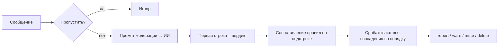

# Поваренная книга Gennady

*Языки: [English](cookbook.md) | **Русский***

Практические рецепты настройки поведения бота через **ИИ‑промпты + опции конфигурации**.
Каждый рецепт ниже - это комбинация приёма в промпте и ключей конфигурации, которые заставляют
его работать. Полный список всех ключей см. в [config_ru.md](config_ru.md) и автогенерируемом
[CONFIG_REFERENCE_ru.md](CONFIG_REFERENCE_ru.md).

> Все промпты можно править вживую в веб-интерфейсе (без перезапуска) или в `config.yaml`.
> В веб-интерфейсе **Диагностика → предпросмотр промпта** показывает, что именно получает модель.

## Содержание

- [Как на самом деле работает модерация](#как-на-самом-деле-работает-модерация)
- [Справочник плейсхолдеров](#справочник-плейсхолдеров)
- [Рецепт 1: Придумайте свой словарь вердиктов](#рецепт-1-придумайте-свой-словарь-вердиктов)
- [Рецепт 2: Несколько действий на один вердикт (удалить + мут)](#рецепт-2-несколько-действий-на-один-вердикт-удалить--мут)
- [Рецепт 3: Запасной выход «пусть решают админы»](#рецепт-3-запасной-выход-пусть-решают-админы)
- [Рецепт 4: Единый свод правил через `{{chat_rules}}`](#рецепт-4-единый-свод-правил-через-chat_rules)
- [Рецепт 5: Строгость с учётом репутации](#рецепт-5-строгость-с-учётом-репутации)
- [Рецепт 6: Проверка профиля нового участника](#рецепт-6-проверка-профиля-нового-участника)
- [Рецепт 7: Не наказывайте за цитируемое](#рецепт-7-не-наказывайте-за-цитируемое)
- [Рецепт 8: Модерация изображений (Vision / OCR / Content Safety)](#рецепт-8-модерация-изображений-vision--ocr--content-safety)
- [Рецепт 9: Реакция на Azure Content Safety через `content-security`](#рецепт-9-реакция-на-azure-content-safety-через-content-security)
- [Рецепт 10: Персональные ИИ-предупреждения с тоном](#рецепт-10-персональные-ии-предупреждения-с-тоном)
- [Рецепт 11: Уведомления о муте с инструкцией повторной проверки](#рецепт-11-уведомления-о-муте-с-инструкцией-повторной-проверки)
- [Рецепт 12: Дайте боту характер (креативные ответы)](#рецепт-12-дайте-боту-характер-креативные-ответы)
- [Рецепт 13: Контроль затрат - лёгкая vs полная модель и резервирование](#рецепт-13-контроль-затрат--лёгкая-vs-полная-модель-и-резервирование)
- [Рецепт 14: Белые списки, админы и исключённые пользователи](#рецепт-14-белые-списки-админы-и-исключённые-пользователи)
- [Рецепт 15: Политические и тематические нюансы с учётом контекста](#рецепт-15-политические-и-тематические-нюансы-с-учётом-контекста)
- [Рецепт 16: Пасхалки и команды по запросу](#рецепт-16-пасхалки-и-команды-по-запросу)
- [Рецепт 17: Адаптируйте сводки к вашему жаргону и редакционным рамкам](#рецепт-17-адаптируйте-сводки-к-вашему-жаргону-и-редакционным-рамкам)
- [Рецепт 18: Маркеры неудачи и фирменная подпись](#рецепт-18-маркеры-неудачи-и-фирменная-подпись)
- [Рецепт 19: Реакции-эмодзи в сводках и ответах](#рецепт-19-реакции-эмодзи-в-сводках-и-ответах)
- [Решение проблем](#решение-проблем)

---

## Как на самом деле работает модерация

Понимание конвейера делает каждый рецепт очевидным:

1. Приходит сообщение. Если пользователь не исключён (админ/белый список/исключение), боту
   отправляется **промпт модерации** (по умолчанию через **лёгкую модель**).
2. Бот читает ответ ИИ и берёт **только первую строку** как *строку вердикта*. Всё, что после
   первой строки, считается необязательным человекочитаемым *пояснением* (попадает в логи и
   показывается админам, но не участвует в выборе действий).
3. У каждого правила в `ai.content_moderation.rules` есть `trigger`. Если триггер встречается
   как **подстрока строки вердикта без учёта регистра**, правило срабатывает.
4. **Срабатывают ВСЕ подходящие правила, в порядке объявления.** Поэтому действия можно
  комбинировать.
5. Действия: `report`, `warn`, `mute`, `delete`.



Два следствия, которые стоит закладывать в дизайн:

- **Держите вердикт коротким и на первой строке.** У ответов модерации небольшой бюджет
  токенов, поэтому идеальная форма - одно слово-вердикт + одна строка пояснения.
- **Триггеры - это подстроки.** `trigger: "спам"` совпадёт со `спам`, `Спам`, `спам, мат`.
  Выбирайте слова-вердикты так, чтобы они случайно не содержали друг друга.

**Жалобы по запросу.** Участник может пожаловаться на сообщение, **ответив на него и упомянув
бота**. Бот заново прогоняет модерацию по *каждой* настроенной модели (то же делает кнопка
**«Проверить снова»** в веб-интерфейсе) и действует, если хотя бы одна нашла нарушение. Если все
модели сочли сообщение чистым, `ai.content_moderation.complaint_manual_moderation` решает, что
делать: `true` (по умолчанию) отправляет админам карточку решения, `false` тихо отклоняет жалобу.

---

## Справочник плейсхолдеров

Плейсхолдеры подставляются перед отправкой. Каждый промпт поддерживает только свой набор.

| Промпт (`ai.…`) | Плейсхолдеры |
| --- | --- |
| `content_moderation.prompt` | `{{message}}`, `{{chat_rules}}`, `{{user_profile}}`, `{{user_reputation}}`, `{{reply_to}}`, `{{new_user_rules}}` |
| `content_moderation.warning_prompt` | `{{username}}`, `{{user_message}}`, `{{chat_rules}}`, `{{mute_info}}`, `{{reputation}}` |
| `creative_replies.prompt` | `{{message}}`, `{{context}}`, `{{quote}}` |
| `morning_greeting.prompt` | `{{weekday}}`, `{{date}}`, `{{weather}}`, `{{weather_ru}}`, `{{holidays}}`, `{{events}}` |
| `daily_summary.prompt` | `{{messages}}` |
| `message_summaries.prompt` | `{{message}}` |
| `link_summaries.prompt` | `{{title}}`, `{{url}}`, `{{content}}`, `{{truncated_suffix}}` |
| `user_profiles.prompt` | `{{username}}`, `{{messages}}` |
| `user_profiles.update_prompt` | `{{username}}`, `{{messages}}`, `{{existing_profile}}` |
| `translation_prompt` / `rss.*` | `{{text}}` |

**`{{user_profile}}` против `{{user_reputation}}`:**

- `{{user_profile}}` разворачивается в **подробный блок** - текст ИИ-профиля + репутация,
  статистика предупреждений/мутов за 7 дней, график активности, отметка админа и
  предупреждения о повторном использовании @username. Максимум контекста, больше токенов.
- `{{user_reputation}}` разворачивается в **компактный блок** - только оценка репутации и
  пометка о подозрительном профиле (с причинами), если она есть. Дёшево по токенам; используйте,
  когда нужна только оценка.

Оба пусты, если не включено `ai.user_profiles.enabled: true` (или
`content_moderation.new_user_profile_check_enabled: true`).

**`{{new_user_rules}}`:** разворачивается в текст `ai.content_moderation.new_user_rules`
**только** пока пользователь «новый» - в течение `ai.content_moderation.new_user_window_hours`
(по умолчанию 24) после его первого замеченного сообщения - и пуст для всех остальных. Используйте
для более строгих правил к первым постам (без ссылок, без промо), не трогая правила для завсегдатаев.

**`{{weather}}` против `{{weather_ru}}`:** утреннее приветствие отдаёт прогноз в двух
предформатированных вариантах - `{{weather}}` отформатирован по-английски, `{{weather_ru}}` -
по-русски. Используйте тот, что соответствует языку промпта; переводить прогноз вручную не нужно.

---

## Рецепт 1: Придумайте свой словарь вердиктов

Вы не ограничены словами `spam`/`profanity`/`nsfw`. Скажите модели отвечать **любыми словами,
какими хотите**, а затем сопоставьте эти слова с действиями. Держите их на первой строке.

```yaml
ai:
  content_moderation:
    prompt:
      system: |
        Ты - классификатор модерации чата. Определи, нарушает ли сообщение правила.
        Правила чата: {{chat_rules}}

        Ответь ТОЛЬКО одним из этих слов на ПЕРВОЙ строке: "спам", "мат", "хз", "нет".
        На ВТОРОЙ строке можешь добавить одно предложение с причиной, если было нарушение.
      user: |
        {{user_profile}}

        Сообщение для анализа:
        «{{message}}»

        Дополнительный контекст (НЕ модерируй это!):
        {{reply_to}}

        Ответь одним словом на первой строке.
    rules:
      - { trigger: "спам", action: delete, description: "Спам",  notify_admin: false }
      - { trigger: "мат",  action: report, description: "Мат/оскорбления", notify_admin: true }
      - { trigger: "хз",   action: report, description: "Спорно", notify_admin: true }
```

Почему работает: слову-вердикту достаточно быть **подстрокой первой строки**. Многословные или
многоязычные вердикты допустимы (референс-конфиг использует русские слова `спам`, `мат`, `хз`,
`нет`).

---

## Рецепт 2: Несколько действий на один вердикт (удалить + мут)

Перечислите **один и тот же триггер дважды** с разными действиями. Сработают оба, по порядку.
Это и удаляет спам, и мутит спамера за один проход.

```yaml
rules:
  - { trigger: "спам", action: delete, description: "Спам", notify_admin: false }
  - { trigger: "спам", action: mute,   description: "Спам", notify_admin: false }
```

Длительность мута берётся из `default_mute_minutes`:

```yaml
ai:
  content_moderation:
    default_mute_minutes: 0   # 0 = навсегда; например 60 = один час
```

> Порядок важен: ставьте `delete` перед `mute`, если хотите сначала убрать сообщение.
> Срабатывают все подходящие правила.

---

## Рецепт 3: Запасной выход «пусть решают админы»

Добавьте вердикт «не уверен», который только **репортит** в админ-чат вместо автоматического
действия. Отлично для спорных случаев, где ложные срабатывания дорого обходятся.

```yaml
ai:
  content_moderation:
    prompt:
      system: |
        … ответь "спам", "мат", "хз" или "нет" на первой строке.
        Используй "хз", когда подозреваешь нарушение, но не уверен - решит человек.
    rules:
      - { trigger: "хз", action: report, description: "Нужен человек", notify_admin: true }
```

`report` отправляет сообщение в админ-чат с инлайн-кнопками (мут / предупреждение / удалить),
чтобы модератор мог отреагировать одним нажатием.

---

## Рецепт 4: Единый свод правил через `{{chat_rules}}`

Запишите правила сообщества **один раз** в `ai.chat_rules` и вставляйте их в любой промпт через
`{{chat_rules}}`. Меняете правила в одном месте - и все промпты следуют за ними.

```yaml
ai:
  chat_rules: |-
    В чате не допускается:
      - Мат в адрес другого участника (отдельное ругательство как восклицание - норм).
      - Личные оскорбления, травля, угрозы.
      - Реклама, промокоды, реферальные ссылки, массовые рассылки.
      - Сообщения из одних эмодзи или предложения «расслабиться» от новых пользователей.
    Разрешено:
      - Слово «хуйло» применительно к президентам отдельных стран нарушением не считается.
  content_moderation:
    prompt:
      system: |
        Определи, нарушает ли сообщение правила. Правила чата: {{chat_rules}}
        …
    warning_prompt:
      system: |
        Напиши предупреждение. Правила чата: {{chat_rules}}
        …
```

Так промпт модерации и промпт предупреждения остаются идеально согласованными.

---

## Рецепт 5: Строгость с учётом репутации

Включите ИИ-профили пользователей. Ежедневная задача строит короткий профиль для каждого
активного пользователя, заканчивающийся строкой `Reputation: good|neutral|bad`. Эта репутация
затем подставляется в модерацию, чтобы бот был мягче к проверенным завсегдатаям и строже к
известным нарушителям.

```yaml
ai:
  user_profiles:
    enabled: true
    time: "04:50"          # время ежедневной пересборки (вне часа пик)
    skip_forever_muted_users: false
  content_moderation:
    prompt:
      system: |
        … Если предоставлен профиль пользователя, учитывай его:
        - Если пользователь обычно общается в грубоватом/дерзком стиле и репутация нормальная,
          не считай привычный стиль нарушением.
        - Если поведение резко смещается в агрессию или троллинг - это нарушение.
        - Для пользователей с плохой репутацией будь строже.
      user: |
        {{user_profile}}

        Сообщение для анализа:
        «{{message}}»
```

Петля обратной связи: сообщения → дневной профиль + репутация → подстановка в модерацию → более
умные решения завтра. Используйте `{{user_reputation}}` вместо `{{user_profile}}`, если хотите
тот же сигнал за долю стоимости токенов.

---

## Рецепт 6: Проверка профиля нового участника

Спам-боты, рекламирующие услуги «18+», коварны: их **сообщение** часто состоит только из
эмодзи (💋🔥💦) без текста, который можно модерировать, поэтому проверка одного лишь текста их
пропускает. Зато их **профиль** - фото, био и привязанный личный канал - обычно их выдаёт.
Проверка `new_user_profile_check_enabled` анализирует **весь публичный профиль за один проход**
при первом сообщении пользователя в чате (выполняется **один раз** на пользователя в чате - без
проблем с лимитами): имя, био и фото профиля, плюс **привязанный личный канал** (название,
описание, фото), если он есть.

Фотографии сначала проверяются через **Azure Content Safety**; Azure Vision и OCR.space нужны
только чтобы *описать* фото, когда Content Safety недоступен или дал сбой. Затем *весь*
собранный текст оценивает отдельный AI-промпт. **Content Safety не требуется** - если он
выключен, фото описывают Vision или OCR.space.

```yaml
ai:
  content_moderation:
    new_user_profile_check_enabled: true
    # Для фото предпочтителен Content Safety; Vision/OCR.space - резервные
    # описатели. Настройте хотя бы один, чтобы фото можно было анализировать:
    content_safety_enabled: true    # основной сигнал по фото (рекомендуется)
    vision_enabled: true            # резервный описатель (или ocrspace_enabled)
    new_user_profile_prompt:
      system: |
        Ты - ассистент модерации, проверяющий публичный профиль нового участника чата.
        Тебе дают его имя, био и описание фото профиля, а также, если есть, название,
        описание и фото привязанного личного канала. Найди признаки спама, мошенничества,
        платной рекламы, контента 18+/NSFW, разжигания ненависти или иных нарушений правил.
        Ответь одной короткой строкой. Если ничего подозрительного - ответь ровно CLEAN.
        Иначе кратко опиши проблему.
      user: |
        Проанализируй следующий профиль:

        {{profile_text}}
```

Промпт получает всё, что собрал бот - имя, username, био, описание фото профиля, название и
описание канала, описание фото канала - через `{{profile_text}}`. Ответ **`CLEAN`** не
записывает ничего; любой другой ответ становится отметкой в профиле пользователя.

> ⚠️ **Сохраняйте соглашение про `CLEAN`.** Если переписываете промпт, он всё равно должен
> требовать ответ ровно `CLEAN` для нормальных профилей. Иначе чистый ответ в свободной форме
> («ничего подозрительного не найдено») считается находкой и попадёт в отметку - получится
> бессмыслица вроде «профиль помечен: ничего подозрительного не найдено». Бот распознаёт `CLEAN`
> и пару частых фраз «ничего не найдено», но одно чёткое ключевое слово куда надёжнее.

### Единый маркер `suspicious-profile`

Когда проверка срабатывает (помеченное фото или AI счёл профиль подозрительным), бот ставит в
профиль единый стабильный маркер:

```
[moderation:suspicious-profile]
```

Это ваш надёжный единый крючок. Сошлитесь на него в промпте модерации, чтобы относиться к таким
пользователям строже:

```yaml
    prompt:
      user: |
        Если сообщение - только эмодзи или предложение «расслабиться» И пользователь пишет
        первое сообщение сегодня, ИЛИ в его профиле есть отметка
        `moderation:suspicious-profile`, ответь "спам".

        {{user_profile}}

        Сообщение: «{{message}}»
```

Как это попадает в модель модерации:

- **`{{user_profile}}`** (полный блок) - заметная строка *ПОДОЗРИТЕЛЬНЫЙ ПРОФИЛЬ* **плюс**
  записанный текст профиля (маркеры и конкретная причина, напр. `Spam: crypto promo channel`).
- **`{{user_reputation}}`** (компактный блок) - заголовок о подозрительности **плюс**
  причина(ы) списком, чтобы даже экономичные промпты видели, *почему* профиль помечен.

---

## Рецепт 7: Не наказывайте за цитируемое

Когда пользователь отвечает на нарушающее сообщение, `{{reply_to}}` даёт модели цитируемый текст
как контекст. Но мутить *отвечающего* за цитату не нужно. Две защиты:

1. **Явно скажите модели**, что контекст ответа не подлежит модерации:

   ```yaml
   user: |
     Сообщение для анализа:
     «{{message}}»

     Дополнительный контекст, если есть (НЕ модерируй это!):
     {{reply_to}}
   ```

   Бот использует **конкретный фрагмент**, который пользователь выделил при ответе (цитаты
   Telegram), а не весь текст сообщения-оригинала - поэтому модель видит именно то, что
   процитировали. Эта точная цитата также попадает в профили пользователей, дневные сводки и
   креативные ответы.

2. **Автоматический повтор (встроен).** Если контент-фильтр Azure срабатывает *и* был включён
   контекст `{{reply_to}}`, бот автоматически повторяет запрос **без** контекста ответа - чтобы
   цитируемый материал не наказал отвечающего. Это работает само; пометка в промпте лишь
   усиливает эффект.

---

## Рецепт 8: Модерация изображений (Vision / OCR / Content Safety)

Ловите нарушения, спрятанные в скриншотах и мемах, извлекая их текст/содержимое и пропуская
через **те же** правила модерации. Два источника, используются цепочкой резервирования
**Azure Vision → OCR.space**:

```yaml
ai:
  content_moderation:
    # Лучшая точность - Azure Vision (описание + OCR)
    vision_enabled: true
    vision_endpoint: "https://YOUR.cognitiveservices.azure.com/"
    vision_api_key: "KEY"

    # Опциональный облачный OCR с бесплатным тарифом, без своего сервера
    ocrspace_enabled: false
    ocrspace_api_key: ""
    ocrspace_engine: 2        # 2 = универсальный, 3 = максимальная точность
```

Извлечённый текст попадает в ваш обычный промпт модерации, поэтому все рецепты вердиктов/правил
работают и для картинок. Для надёжной модерации предпочтительнее **Azure Vision**.

---

## Рецепт 9: Реакция на Azure Content Safety через `content-security`

`content-security` - **зарезервированный триггер**. Когда Azure Content Safety блокирует
контент, бот пропускает событие через ваши правила с этим триггером - то есть решаете вы.

```yaml
rules:
  - { trigger: "content-security", action: report, description: "Сработал фильтр безопасности", notify_admin: true }
  # Или агрессивно:
  # - { trigger: "content-security", action: delete, notify_admin: false }
  # - { trigger: "content-security", action: mute,   notify_admin: false }
```

Если Content Safety сработал, но правило `content-security` **не** настроено, событие
пропускается с записью в лог - поэтому при `content_safety_enabled: true` всегда добавляйте хотя
бы правило `report`.

---

## Рецепт 10: Персональные ИИ-предупреждения с тоном

Когда пользователь переходит черту, бот может опубликовать персональное предупреждение. Сделайте
**тон зависимым от репутации** - мягко для хорошей репутации, резко для рецидивистов.

```yaml
ai:
  content_moderation:
    warning_prompt:
      system: |
        Ты - модератор чата. Напиши персональное предупреждение. Оно должно быть:
        - персональным (используй имя), можно ехидным или с сарказмом
        - ясно объяснять проблему БЕЗ цитирования сообщения
        - содержать эмодзи ⚠️, 1–2 предложения
        - если репутация известна, подстройся: вежливо для хорошей, резче для плохой.
          НЕ упоминай саму репутацию.
        Правила чата: {{chat_rules}}
      user: |
        Создай предупреждение для {{username}}.
        Репутация (если известна): '{{reputation}}'
        {{mute_info}}
        Сообщение: {{user_message}}
```

`{{user_message}}` заполняется только при наличии нарушающего сообщения; `{{reputation}}` - только
когда профиль существует.

---

## Рецепт 11: Уведомления о муте с инструкцией повторной проверки

`ai.warning_mute` - текст, который вставляется в `{{mute_info}}` **только когда пользователь
реально получил мут**. Используйте `{{muted_for}}` для подстановки оставшейся длительности и
добавьте любые свои инструкции (например, шаг повторной проверки через капча-бота).

```yaml
ai:
  warning_mute: |-

    Закончи сообщение чем-то вроде:
    "🔇 Вы заглушены на {{muted_for}}. После окончания пройдите повторную проверку у моего
    коллеги @your_captcha_bot, сыграв в быструю игру, прежде чем снова сможете комментировать."
```

`{{muted_for}}` отображается как человеческая длительность (например, «1 час») или «навсегда» для
постоянных мутов. Поскольку это появляется только при активном муте, ваш промпт предупреждения
остаётся чистым для предупреждений без мута.

---

## Рецепт 12: Дайте боту характер (креативные ответы)

Изредка остроумные ответы оживляют сообщество. Задайте персону в системном промпте и ограничьте
частоту, чтобы бот оставался обаятельным, а не назойливым.

```yaml
ai:
  creative_replies:
    enabled: true
    use_full_model: true       # характеру помогает более сильная модель
    max_messages: 6            # не более N ответов …
    time_window: 12            # … за столько минут
    follow_up_only_same_user: false
    prompt:
      system: |
        Ты - «Геннадий», бот-гопник, который зависает в этом чате. Отвечай интересно, дерзко или
        полезно - придумай свой ответ, не пересказывай старые сообщения. Коротко и естественно,
        как четкий пацан у подъезда. Будь нагловатым и обаятельным, говори по-простому с гоповатым
        говорком, на грубость отвечай сухим, чуть угрожающим сарказмом. Без мата.
      user: |
        Ответь на это сообщение: "{{message}}"
        {{context}}
```

Снижайте `max_messages` / `time_window`, если бот слишком болтлив. `{{context}}` несёт недавние
окружающие сообщения; `{{quote}}` (если используется) - конкретное цитируемое сообщение.

---

## Рецепт 13: Контроль затрат - лёгкая vs полная модель и резервирование

- **Модерация по умолчанию идёт на лёгкой модели** - держите её дешёвой и быстрой, а вердикты в
  одно слово, чтобы ответы оставались крошечными.
- Используйте **полную модель** только там, где важно качество (креативные ответы, сводки) через
  `use_full_model: true` у каждой функции.
- И `light_model`, и `full_model` принимают **список эндпоинтов** с автоматическим
  резервированием: если первый эндпоинт даёт ошибку, бот переключается на следующий.

```yaml
ai:
  light_model:
    - endpoint: https://primary.openai.azure.com/
      api_key: "KEY1"
      deployment_name: gpt-5-nano
      omit_max_tokens: true        # для моделей, отвергающих параметр max_tokens
    - endpoint: https://secondary.services.ai.azure.com/
      api_key: "KEY2"
      deployment_name: gpt-5-mini
      omit_max_tokens: true
  full_model:
    - endpoint: https://primary.openai.azure.com/
      api_key: "KEY1"
      deployment_name: gpt-5-chat
```

Можно также указать в записи обычный OpenAI или любой OpenAI-совместимый шлюз через
`provider: openai` (см. [config_ru.md](config_ru.md)).

---

## Рецепт 14: Белые списки, админы и исключённые пользователи

Несколько независимых способов освободить людей от модерации:

```yaml
admin:
  whitelist_user_ids: [111111111, 222222222, 777000]   # никогда не модерируются (777000 = служба Telegram)

ai:
  content_moderation:
    skip_admin_users: false        # true = никогда не модерировать админов чата

message_summaries:
  excluded_user_ids: [111111111]   # не делать сводки длинных постов этих пользователей
```

- `whitelist_user_ids` - полностью освобождены от модерации.
- `skip_admin_users` - освобождает именно админов чата (в референс-конфиге это `false`, то есть
  админы *модерируются*).
- `excluded_user_ids` / `excluded_topics` внутри конкретной функции ограничивают только её.

> 💡 **Оставьте `777000` в `whitelist_user_ids`.** Это служебный аккаунт самого Telegram: он
> публикует сообщения привязанного канала в чат обсуждения и присылает служебные уведомления.
> Добавление его в белый список не даёт боту модерировать эти автоматические посты. Именно
> поэтому он есть в конфиге по умолчанию.

---

## Рецепт 15: Политические и тематические нюансы с учётом контекста

Поскольку вердикт выдаёт LLM, читающая ваши `{{chat_rules}}` и промпт, можно закодировать
**тонкую, асимметричную** политику, недоступную фильтру по ключевым словам. Прописывайте крайние
случаи явно.

```yaml
ai:
  content_moderation:
    prompt:
      system: |
        Правила чата: {{chat_rules}}
        - Критика (без явного мата) определённых политиков - НЕ нарушение.
        - Слово «хуйло» применительно к президентам отдельных стран нарушением не считается.
        - «Нахер» здесь не мат - есть уважаемый чешский депутат по фамилии Nacher.
        - Такая же атака на защищаемую группу - серьёзное нарушение.
        - Отдельное ругательство как восклицание - норм; мат В АДРЕС человека - нет.
```

Это работает в обе стороны. Можно **разрешить похожее на мат слово**, которое в вашем контексте
безобидно (имя, топоним, заимствование вроде `Nacher`), чтобы убрать ложные срабатывания, и можно
**разрешить действительно грубое слово** в адрес узкой цели, по-прежнему запрещая его в адрес
участников. Регулярка такого не различит - LLM, читающая ваши правила, различит.

Модель применяет эти различия к каждому сообщению, учитывая `{{reply_to}}` и `{{user_profile}}`.
Это главное преимущество LLM-модерации над списками регулярных выражений - вкладывайтесь в ясные,
богатые примерами правила.

---

## Рецепт 16: Пасхалки и команды по запросу

Поскольку креативные ответы свободной формы, в персону можно зашить **поведение по согласию**:
когда - и только когда - пользователь явно о чём-то просит, бот подыгрывает. Без кода, без
обработчика слэш-команд; достаточно одной фразы в системном промпте.

```yaml
ai:
  creative_replies:
    enabled: true
    use_full_model: true
    prompt:
      system: |
        Ты - «Геннадий», … (твоя персона) …
        Если - и ТОЛЬКО если - пользователь явно попросил у тебя «VIP-пропуск»,
        подыграй и «выдай» его, сопроводив милым эмодзи (пиво 🍺, подарок 🎁, цветы 💐).
        Никогда не делай этого по своей инициативе - только по явной просьбе.
      user: |
        Ответь на это сообщение: "{{message}}"
        {{context}}
```

Почему работает: любое описанное условное поведение становится неформальной «командой», которую
сообщество может открыть. **Закройте его явной просьбой** («только если явно попросили»), чтобы
оно не срабатывало случайно, и держите `max_messages` / `time_window` разумными, чтобы шутка
оставалась особенной.

---

## Рецепт 17: Адаптируйте сводки к вашему жаргону и редакционным рамкам

Сводки (`daily_summary`, `message_summaries`, `link_summaries`, `rss`) тоже работают на промптах
свободной формы. Два ценных дополнения: **глоссарий** местного сленга, чтобы модель понимала
внутренние шутки, и **редакционные рамки**, чтобы сводка не подставила сообщество.

```yaml
ai:
  daily_summary:
    enabled: true
    use_full_model: true
    prompt:
      system: |
        Ты делаешь сводку дня для этого сообщества.
        Местный жаргон (для контекста):
          - «дейлик» = наш постоянный тред про сегодняшние новости.
          - «мост» = место встреч в центре, о котором упоминают участники.
        Редакционные рамки:
          - Не называй имена конкретных участников.
          - Держись нейтрально; не занимай сторон в чувствительных темах.
          - 4–5 предложений, живо и разговорно.
        Начни с «📊 Сводка дня:».
      user: |
        Проанализируй сообщения за сегодня:
        {{messages}}
```

Почему работает: модель знает только то, что вы ей сказали. Короткий глоссарий превращает
непонятные внутренние шутки в точные сводки, а явные правила «никогда не говори X / всегда говори
Y» держат тон в рамках бренда. Тот же приём подходит для `summary_prompt` в RSS - например,
«всегда указывай номер дела и судью (zpravodaj)» для ленты судебных новостей.

---

## Рецепт 18: Маркеры неудачи и фирменная подпись

Для сводок ссылок / RSS / сообщений дайте модели одно **слово-маркер**, которое она выдаёт, когда
нет ничего полезного (не удалось получить страницу, защита от ботов, пейволл, страница согласия),
чтобы бот молчал, а не публиковал мусор. Опционально добавьте **фирменную фразу** для характера.

```yaml
ai:
  link_summaries:
    enabled: true
    use_full_model: true
    min_summary_length: 10        # вторая страховка: отбрасывать слишком короткие результаты
    prompt:
      system: Ты кратко излагаешь содержание веб-страниц.
      user: |
        Перескажи страницу в 2–3 предложениях.
        Заканчивай фразой «Это многое говорит о нашем обществе.», кроме случаев, когда это совсем неуместно.
        Если не удалось получить содержимое (защита от ботов, переадресация, ошибка загрузки,
        уведомление о рекламе/согласии вместо статьи) - ответь только одним словом «Пусто».

        Заголовок: {{title}}
        URL: {{url}}
        Содержание {{truncated_suffix}}:
        {{content}}
```

Почему работает: маркер вроде «Пусто» (или `Empty`) боту легко распознать и подавить, так что
неудачное извлечение никогда не превратится в вводящий в заблуждение пост. `min_summary_length`
ловит то, что проскользнуло. Строка-подпись - чистый брендинг: она даёт каждой сводке единый
голос.

---

## Рецепт 19: Реакции-эмодзи в сводках и ответах

Реакции-эмодзи в Telegram - сильный и малошумный сигнал того, как чат воспринял сообщение.
Включите их - и бот сохранит для каждого сообщения карту `эмодзи→счётчик`, а затем подмешает её
в AI-контекст для **дневных сводок**, **креативных ответов** и **профилей пользователей**.

```yaml
ai:
  enabled: true
  track_reactions: true
```

Что для этого нужно:

- **Агрегированные счётчики** (`message_reaction_count`) работают в любом чате без особых прав -
  это основной источник истины.
- **Пособытийные реакции** (`message_reaction`) дополнительно требуют, чтобы бот был
  **администратором чата**. Они поддерживают счётчики актуальными, даже когда агрегат запаздывает.

Реакции **не** входят в стандартный набор обновлений Telegram, поэтому бот подписывается на них
автоматически только при `track_reactions: true` (и `ai.enabled`). После сохранения реакции
появляются в AI-контексте компактной меткой, например:

```
[14:03] alice: новый релиз отличный [reactions: 👍12 🔥4]
```

Используйте это в промпте сводки, чтобы взвесить то, что реально зацепило чат:

```yaml
ai:
  daily_summary:
    prompt:
      user: |
        Сделай сводку сегодняшней дискуссии. Особое внимание удели сообщениям с большим числом
        реакций - они отражают то, что группе было интереснее или смешнее всего.

        {{messages}}
```

Отдельный плейсхолдер не нужен: метки реакций уже встроены в строки сообщений, которые бот
передаёт в `{{messages}}` (и в контекст цепочки ответов для креативных ответов).

---

## Решение проблем

| Симптом | Вероятная причина | Решение |
| --- | --- | --- |
| Действия никогда не срабатывают | Слово-вердикт не является подстрокой **первой строки**, либо модель добавляет преамбулу | Скажите модели отвечать ТОЛЬКО словом-вердиктом на строке 1; проверьте промпт в Диагностике |
| Пояснение воспринимается как триггер | Триггер правила встречается в строке пояснения | Бот сопоставляет только **первую строку** - вердикт на строке 1, причина на строке 2 |
| Срабатывают два правила неожиданно | Триггеры пересекаются как подстроки (`спам` внутри `не-спам`) | Выбирайте различающиеся слова-вердикты |
| Отвечающих мутят за цитируемый текст | Цитата принята за сообщение пользователя | Добавьте пометку «НЕ модерируй это» к `{{reply_to}}`; авто-повтор тоже защищает |
| Репутация не появляется | `ai.user_profiles.enabled: false` или задача ещё не отработала | Включите; профили строятся по ежедневному расписанию |
| Content Safety блокирует, но ничего не происходит | Нет правила `content-security` | Добавьте правило `content-security` (Рецепт 9) |
| Текст мута отсутствует в предупреждениях | Пользователь не получил мут, либо `warning_mute` пуст | `{{mute_info}}` заполняется только при активном муте |
| Модерация выглядит обрезанной | Вердикт + длинная причина превышают малый бюджет токенов | Держите ответ в одно слово-вердикт + одну короткую строку |

---

*См. также: [config_ru.md](config_ru.md) · [CONFIG_REFERENCE_ru.md](CONFIG_REFERENCE_ru.md) · [README_ru.md](../README_ru.md)*
